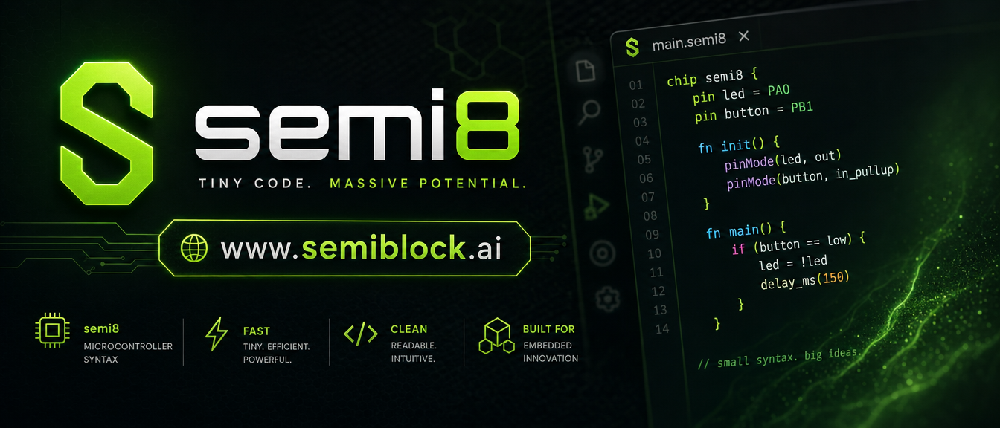

# Semi8 Assembly for VS Code

Syntax highlighting for the **Semi8** (also known as Open8) 8-bit microcontroller assembly language.

## Features

- Syntax highlighting for Semi8/Open8 assembly (`.s`, `.S`, `.s8`, `.semi8`, etc.)
- Recognizes all instructions from the Semi8 instruction set (including implemented subset and documented extensions)
- Highlights registers (`R0`–`R31` and index `X`/`Y`/`Z` variants), labels, numbers (decimal, hex `0x`, binary `0b`), comments (`;` and `//`), and common assembler directives (`.equ`, `ORG`, `DB`, etc.)
- Comment toggling with `;`

## Usage

1. Open any `.s` (or supported extension) file containing Semi8 assembly.
2. If the language is not auto-detected, use the command palette (`Cmd+Shift+P` / `Ctrl+Shift+P`) and select **"Change Language Mode"** → **"Semi8 ASM"**.

Alternatively, add to your VS Code `settings.json`:

```json
"files.associations": {
  "*.s": "semi8-asm"
}
```

**Tip:** To debug highlighting, run the **Developer: Inspect Editor Tokens and Scopes** command (from Command Palette) and hover over tokens in a Semi8 file. This shows the scopes applied by the TextMate grammar.

## Supported Instructions (highlights)

Includes (case-insensitive):
`ADC ADD AND ANDI ASR BLD BREAK BRCC BRCS BREQ BRGE BRLT BRNE BST CBR CBI CALL CLR COM CPC CP DEC EOR INC IN JMP LD LDD LDI LDS LPM LSL LSR MOV MOVW MUL NEG NOP OR ORI OUT POP PUSH RET RETI RJMP ROL ROR SBC SBI SBR SEI CLI SLEEP SPM ST STD STS SUB SUBI SWAP TST WDR` and pseudo-ops like `CLR LSL ROL TST SER`.

See the [Semi8 instruction reference](https://github.com/semiblock/semi8/blob/main/doc/instruction.md) and [program example](https://github.com/semiblock/semi8/blob/main/program.s) in the main Semi8 repository.

Also supports common assembler directives (case-insensitive, with or without dot prefix): `EQU SET DB DW DL DS ORG SECTION MACRO ENDM INCLUDE IF ELSE ENDIF DEFINE`.

## Installation (Development)

- Clone this repo
- Open the `Semi8-VSCode` folder in VS Code
- Press `F5` to launch an Extension Development Host
- Open a `.s` file in the new window to test highlighting

## Packaging

```bash
npm install -g @vscode/vsce
vsce package
```

This produces a `.vsix` file you can install manually via **Extensions: Install from VSIX...** or `code --install-extension semi8-asm-*.vsix`.

## Publishing to the VS Code Marketplace

### Prerequisites

1. **Create / own a publisher**
   - Go to https://marketplace.visualstudio.com/manage
   - Log in with a Microsoft account.
   - Create a publisher (or select an existing one).  
     The `publisher` field in `package.json` is currently set to `"semiblock"`. You must own the `semiblock` publisher, or change the field to your own publisher ID.

2. **Create a Personal Access Token (PAT)**
   - In Azure DevOps (https://dev.azure.com), go to **User settings → Personal access tokens → New Token**.
   - Set:
     - Organization: **All accessible organizations**
     - Scopes → Custom → **Marketplace (Manage)**
   - Copy the token (you will only see it once).

3. **Install vsce**
   ```bash
   npm install -g @vscode/vsce
   ```

4. **(Recommended) Add a proper icon**
   - Create a square PNG icon (minimum 128×128, ideally 256×256) — e.g. `icon.png`.
   - Do **not** use the wide `banner.png`.
   - Add to `package.json`:
     ```json
     "icon": "icon.png"
     ```
   - Re-package/publish after adding.

### Publish steps

```bash
# 1. Login with your publisher (stores the token securely)
vsce login hongkongprogrammingsociety

# 2. (Optional but recommended) Test by packaging first
vsce package

# 3. Publish (bumps patch version by default, or use `minor` / `major` / explicit version)
vsce publish
# or with the token directly:
# vsce publish -p <your-pat-here>

# To publish a specific version increment:
# vsce publish minor
```

- `vsce publish` will:
  - Update the version in `package.json` (if you pass `minor` etc.).
  - Create a git tag/commit if you're in a git repo (optional).
  - Upload to the Marketplace.

After publishing, the extension will appear at:
`https://marketplace.visualstudio.com/items?itemName=semiblock.semi8-asm`

Users can then install it directly from the Extensions view in VS Code.

### Tips & common issues

- **403 / 401 errors**: Make sure the PAT has **Marketplace (Manage)** and **All accessible organizations**.
- **Icon requirements**: Must be a PNG (no SVG). 128×128 minimum.
- **Links & images**: All image URLs in README must be https. Relative links are rewritten automatically by vsce when a `repository` field points to a public GitHub repo (already set).
- **Keywords limit**: Max 30 keywords (we are well under).
- **First publish**: The extension name + publisher combination must be unique.
- For CI/CD (GitHub Actions, Azure Pipelines): Prefer Microsoft Entra ID / workload identity federation over long-lived PATs (see official docs).

See the official guide: https://code.visualstudio.com/api/working-with-extensions/publishing-extension

## Related

- [Semi8 Project](https://github.com/semiblock/semi8)
- [SemiBlock](https://www.semiblock.ai)
